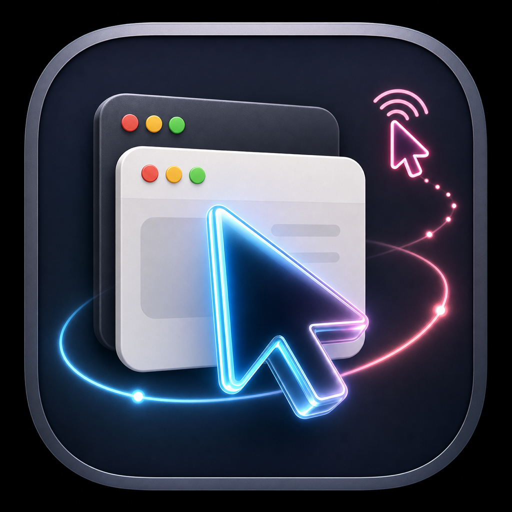

<p align="center">
  
</p>

# Look Mum No Hands

Look Mum No Hands is a local macOS MCP server for agents that need to inspect and operate desktop apps without taking over your real pointer. It exposes macOS Accessibility state, window metadata, and focus-aware action tools so an agent can work in the background while your primary mouse stays yours.

The project is written in Swift and is split into:

- `LMNHCore`: shared automation logic for permissions, running apps, windows, accessibility snapshots, element lookup, action execution, virtual cursor state, redaction, and audit logging.
- `lmnh-mcp`: a stdio MCP server for clients such as Codex, Cursor, and Claude.
- `lmnh-mcp-http`: a local HTTP JSON-RPC MCP server at `http://127.0.0.1:8765/mcp` by default.
- `lmnh-control`: a SwiftUI control app for permissions, cursor appearance, HTTP server controls, install helpers, and recent MCP logs.

## How It Works

Agents do not get a raw remote-control tunnel. They get a focused tool surface:

1. The client starts `lmnh-mcp` over stdio or calls the local HTTP MCP endpoint.
2. The server reports permission state with `macos_permission_status`.
3. Observation tools list apps, windows, and structured accessibility snapshots.
4. The agent resolves a stable `snapshot_id` and `element_id`.
5. Action tools prefer semantic Accessibility operations such as `AXPress` or `AXValue` changes before falling back to more invasive paths.
6. A visual-only virtual cursor shows what the agent is attending to, pressing, or typing. It does not move the real mouse.
7. Tool calls are audited to local logs so behavior can be reviewed.

The current MCP tool surface includes:

- `macos_permission_status`
- `macos_open_app`
- `macos_list_apps`
- `macos_list_windows`
- `macos_snapshot`
- `macos_get_element`
- `macos_find_elements`
- `macos_get_screenshot`
- `macos_set_virtual_cursor`
- `macos_hide_virtual_cursor`
- `macos_perform_action`
- `macos_click`
- `macos_type_text`

Screenshot image capture is still being wired in this slice; the screenshot tool currently returns metadata rather than full image content.

## Requirements

- macOS 26.0 or newer as declared by the Swift package.
- Swift 6.3 toolchain.
- Accessibility permission for UI inspection and semantic actions.
- Screen & System Audio Recording permission for screenshot-related features as they are completed.

## Build And Run

Build everything:

```bash
swift build
```

Run the control app:

```bash
swift run lmnh-control
```

Run the stdio MCP server directly:

```bash
swift run lmnh-mcp
```

Run the HTTP MCP server:

```bash
swift run lmnh-mcp-http --port 8765
```

Run the local verification script:

```bash
scripts/verify.sh
```

## Client Setup

The control app can install development MCP configs for Cursor, Codex, and Claude from the `LMNH` menu.

For Cursor, the repo-local config is `.cursor/mcp.json`.

For Codex, the repo-local config is `.codex/config.toml`.

Both configs point at the local development build, so run `swift build` before using the server from an MCP client.

## App Icon

The app icon source is bundled at `Sources/LMNHControlApp/Resources/AppIcon.png`. The macOS asset catalog lives at `Sources/LMNHControlApp/Resources/Assets.xcassets/AppIcon.appiconset`, and the control app also loads the PNG at launch so SwiftPM runs show the same icon.
