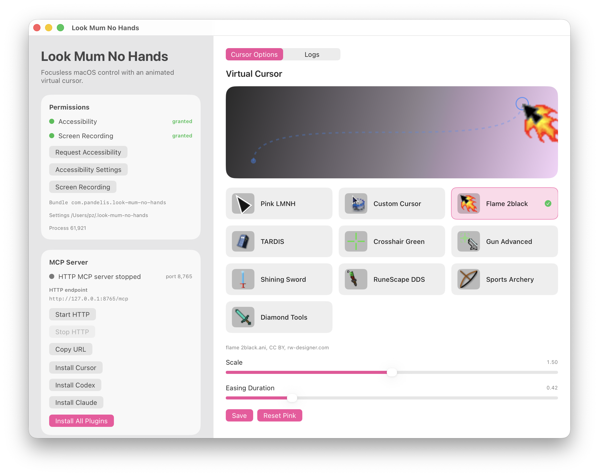
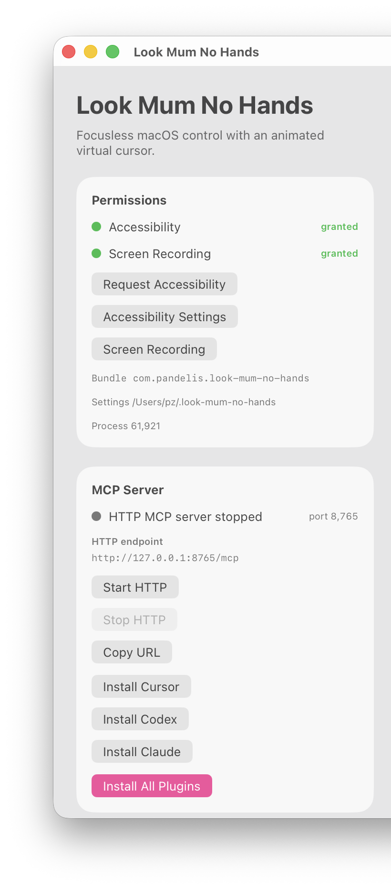
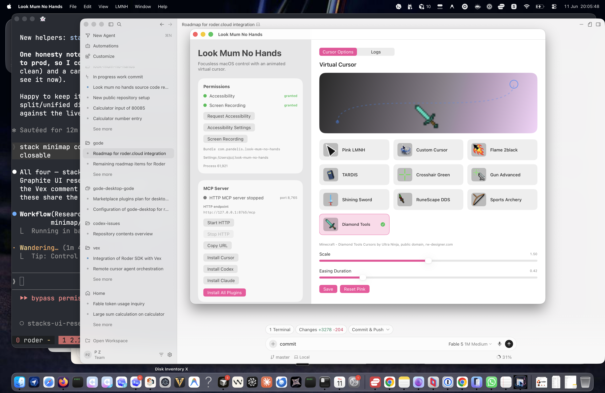
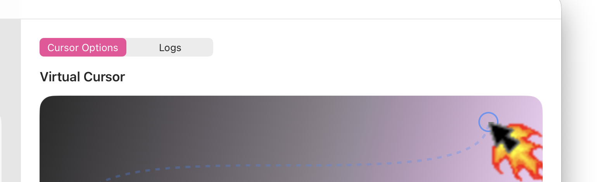

<p align="center">
  
</p>

# Look Mum No Hands

Look Mum No Hands is a local macOS MCP server that lets AI agents inspect and operate desktop apps without taking over your real mouse pointer.

It gives agents a focused macOS tool surface:

- read Accessibility state, running apps, windows, and UI elements
- click, type, scroll, and perform semantic Accessibility actions
- show a visual-only virtual cursor so you can see what the agent is doing
- keep a local audit log of MCP calls
- install local MCP configs for Cursor, Codex, and Claude from a small SwiftUI control app

The real mouse does not move. The virtual cursor is an overlay only.

<p align="center">
  
</p>

<p align="center"><em>The SwiftUI control app: grant permissions, install MCP configs, pick a virtual cursor style, and tail the MCP audit log.</em></p>

## Setup in Cursor

Use this section if you want LMNH in **Cursor Agent** (or Chat with MCP tools enabled).

### 1. Open this repo in Cursor

Clone the repo and open the checkout as your Cursor workspace. LMNH is configured per-workspace via `.cursor/mcp.json`.

### 2. Build the MCP server

From the repo root:

```bash
swift build
```

The wrapper script auto-builds `lmnh-mcp` on first use if you skip this step, but building once upfront is faster.

### 3. Grant macOS permissions

```bash
swift run lmnh-control
```

In the control app **Permissions** card:

1. Click **Request Accessibility** and enable Look Mum No Hands in System Settings.
2. Click **Screen Recording** if you want screenshot tools (`macos_get_screenshot`).
3. Quit and reopen Cursor after changing permissions.

macOS ties permissions to the executable that requests them. Cursor launches `lmnh-mcp` as a child process, so you may need to enable Accessibility for **both** Cursor and `lmnh-mcp` (or the debug binary under `.build/debug/`).

<p align="center">
  
</p>

### 4. Install the MCP server config

**Option A — control app (recommended)**

In the control app, click **Install Cursor**. This writes `.cursor/mcp.json` in the repo.

**Option B — use the bundled config**

If you cloned this repo, `.cursor/mcp.json` is already checked in. It should look like:

```json
{
  "mcpServers": {
    "look-mum-no-hands": {
      "type": "stdio",
      "command": "bash",
      "args": [
        "${workspaceFolder}/plugins/look-mum-no-hands/scripts/run-lmnh-mcp.sh"
      ],
      "env": {
        "LMNH_REPO_ROOT": "${workspaceFolder}",
        "LMNH_LOG_LEVEL": "debug",
        "LMNH_OVERLAY_RENDERER": "headless"
      }
    }
  }
}
```

The launch script builds `lmnh-mcp` if needed and runs `.build/debug/lmnh-mcp`.

### 5. Enable MCP in Cursor

1. Open **Cursor Settings → MCP** (or **Features → MCP**).
2. Confirm `look-mum-no-hands` appears under MCP Servers with a green/connected status.
3. If it is offline, click refresh or fully quit and reopen Cursor.
4. Make sure MCP tools are enabled for the mode you use (Agent, Chat, etc.).

### 6. Verify with an example prompt

Start a **new Agent** chat in this workspace and paste:

```text
Use the Look Mum No Hands MCP tools (not osascript or shell keyboard events).

1. Call macos_permission_status and tell me if anything is missing.
2. Call macos_list_apps and macos_snapshot for the frontmost window.
3. Find a clickable button or menu item in the snapshot and press it with macos_perform_action (AXPress) or macos_click.
4. Tell me what changed and whether the real mouse moved (it should not).
```

A shorter smoke-test prompt:

```text
Use Look Mum No Hands: check macos_permission_status, snapshot the frontmost window, and describe the three most prominent interactive elements you see.
```

If tools are missing from the agent's tool list, the MCP server is not connected — recheck step 5 and the [troubleshooting](#troubleshooting) section.

<p align="center">
  
</p>

<p align="center"><em>LMNH running locally while an agent in Cursor drives macOS through the MCP server — your real mouse stays put.</em></p>

### Optional: teach the agent the LMNH workflow

The repo bundles an agent skill at `plugins/look-mum-no-hands/skills/look-mum-no-hands/SKILL.md`. To make Cursor prefer LMNH over `osascript` / AppleScript on every session, add a project rule (`.cursor/rules/look-mum-no-hands.mdc`) that points agents at that skill, or paste its guidance into a User Rule.

## Quick Start

### 1. Build the local server

From the repo root:

```bash
swift build
```

This creates the development binaries under `.build/debug/`:

- `.build/debug/lmnh-control`
- `.build/debug/lmnh-mcp`
- `.build/debug/lmnh-mcp-http`

### 2. Open the control app

```bash
swift run lmnh-control
```

The control app is the easiest setup path. It shows permission status, MCP logs, cursor options, HTTP server controls, and install buttons for supported clients.

### 3. Grant macOS permissions

In the control app, open the Permissions card.

1. Click `Request Accessibility`.
2. Enable Look Mum No Hands in System Settings.
3. Click `Screen Recording` and enable Screen & System Audio Recording if you want screenshot-related tools.
4. Quit and reopen the app or restart your MCP client after changing permissions.

macOS permissions are tied to the exact app or executable identity. If permissions look enabled but LMNH still reports denied, see [Troubleshooting Permissions](#troubleshooting-permissions).

### 4. Install MCP client configs

In the control app, click **Install All Plugins**, or install one client at a time.

For **Cursor**, see [Setup in Cursor](#setup-in-cursor) for the full walkthrough and example prompts.

Codex and Claude register a stdio server that runs `.build/debug/lmnh-mcp` directly. Run `swift build` again whenever you change the server code, then restart the client.

### 5. Restart your AI client

Restart Cursor, Codex, Claude, or the specific session using LMNH so it starts the current `lmnh-mcp` binary.

## Requirements

- macOS 26.0 or newer, matching `Package.swift`
- Swift 6.3 toolchain
- Accessibility permission for UI inspection and actions
- Screen & System Audio Recording permission for screenshot capture
- One or more MCP clients, such as Cursor, Codex, or Claude

## What Gets Installed

The control app installs development configs. It does not move the repo or copy a packaged server somewhere else.

### Cursor

`Install Cursor` writes a repo-local config at `.cursor/mcp.json`. It launches the server through `plugins/look-mum-no-hands/scripts/run-lmnh-mcp.sh`, which builds and runs `.build/debug/lmnh-mcp` from the repo root.

See [Setup in Cursor](#setup-in-cursor) for step-by-step instructions and example prompts.

### Codex

`Install Codex` runs the Codex CLI and registers:

```text
look-mum-no-hands-dev
```

The registered command points at:

```text
/absolute/path/to/look-mum-no-hands/.build/debug/lmnh-mcp
```

The app searches common CLI locations for `codex`, including `PATH`, `~/.local/bin`, Homebrew, `fnm`, and `nvm` installs.

### Claude

`Install Claude` registers:

```text
look-mum-no-hands-dev
```

It also links the bundled Claude skill into:

```text
~/.claude/skills/look-mum-no-hands
```

The app searches common CLI locations for `claude`, including `PATH`, `~/.local/bin`, Homebrew, `fnm`, and `nvm` installs.

## Manual Client Setup

Use the control app if possible. Manual setup is useful if you want to configure a different MCP client.

First build the server:

```bash
swift build --product lmnh-mcp
```

Then configure your client to run:

```bash
/absolute/path/to/look-mum-no-hands/.build/debug/lmnh-mcp
```

Example MCP server entry:

```json
{
  "mcpServers": {
    "look-mum-no-hands-dev": {
      "command": "/absolute/path/to/look-mum-no-hands/.build/debug/lmnh-mcp",
      "args": [],
      "env": {
        "LMNH_LOG_LEVEL": "debug"
      }
    }
  }
}
```

For Codex CLI, the equivalent command is:

```bash
codex mcp add look-mum-no-hands-dev -- /absolute/path/to/look-mum-no-hands/.build/debug/lmnh-mcp
```

For Claude CLI:

```bash
claude mcp add --scope user look-mum-no-hands-dev -- /absolute/path/to/look-mum-no-hands/.build/debug/lmnh-mcp
```

## Using The Control App

### Permissions

The Permissions card shows:

- Accessibility status
- Screen Recording status
- current bundle identifier
- current process identifier
- LMNH state directory

Buttons:

- `Request Accessibility`: asks macOS to prompt for Accessibility permission.
- `Accessibility Settings`: opens the Accessibility privacy pane.
- `Screen Recording`: opens the Screen & System Audio Recording privacy pane.

### MCP Server

The MCP Server card includes HTTP controls and install buttons.

Buttons:

- `Start HTTP`: starts the HTTP MCP server in the control app.
- `Stop HTTP`: stops the HTTP MCP server.
- `Copy URL`: copies the HTTP endpoint.
- `Install Cursor`: writes `.cursor/mcp.json`.
- `Install Codex`: registers the Codex MCP server.
- `Install Claude`: registers the Claude MCP server and links the Claude skill.
- `Install All Plugins`: runs all three install steps.

The default HTTP endpoint is:

```text
http://127.0.0.1:8765/mcp
```

Most desktop clients should use the stdio server (`lmnh-mcp`). Use HTTP only when your client supports HTTP JSON-RPC MCP connections or for local testing.

### Cursor Options

The Cursor Options pane controls the virtual cursor overlay:

- choose the cursor artwork
- preview the selected cursor
- adjust size and animation timing

<p align="center">
  
</p>

The bundled cursor styles include the default LMNH cursor and several RealWorld Designer cursor assets. The source and license notes for those assets live at:

```text
Sources/LMNHCore/Resources/Cursors/RealWorldPointers/RealWorldPointers-SOURCE.md
```

The virtual cursor:

- tilts in the direction of travel
- returns upright at the destination
- shrinks briefly on click and restores to full size
- hides after 10 seconds of inactivity
- never moves the real macOS pointer

### Logs

The Logs pane tails the local MCP audit log.

If no calls have happened yet, the app shows the log path. Once a client starts using LMNH, recent MCP calls appear in this pane.

## MCP Tools

LMNH currently exposes these tools:

- `macos_permission_status`
- `macos_open_app`
- `macos_list_apps`
- `macos_list_windows`
- `macos_snapshot`
- `macos_get_element`
- `macos_find_elements`
- `macos_get_screenshot` — ScreenCaptureKit capture of the frontmost window, a specific window, a display, or a snapshot element region; supports `max_width` downscaling and `png`/`jpeg` output
- `macos_set_virtual_cursor`
- `macos_hide_virtual_cursor`
- `macos_perform_action`
- `macos_click`
- `macos_scroll` — focusless scrolling that drives the target's Accessibility scroll bars; works on background windows and never moves the real mouse or changes focus
- `macos_type_text` — focusless AXValue text mutation with optional `submit: true` to fire the element's `AXConfirm` action afterwards

Typical agent flow:

1. Call `macos_permission_status`.
2. Call `macos_list_apps` or `macos_open_app`.
3. Call `macos_snapshot` for the target app or frontmost window.
4. Pick a stable `snapshot_id` and `element_id`.
5. Use `macos_perform_action`, `macos_click`, or `macos_type_text`.
6. Watch the virtual cursor and review logs if needed.

## How It Works

LMNH is intentionally not a raw remote-control tunnel.

The MCP server gives agents structured macOS state and focused actions:

- app and window enumeration
- Accessibility snapshots
- stable element lookup
- semantic AX actions before fallback click behavior
- local command audit logging
- visual cursor overlay for user awareness

### Background by design

LMNH never activates or raises a window. Inspection (`macos_snapshot`, `macos_get_screenshot`), interaction (`macos_perform_action`, `macos_click`, `macos_scroll`), and text entry (`macos_type_text`) all operate on background windows through the Accessibility API and per-window screen capture, so the app you are looking at never changes. There is deliberately no global key-press tool: keyboard shortcuts on a background app are expressed as Accessibility actions (`AXPress` on a menu item, `AXConfirm`, `AXCancel`, `AXPick`) instead of synthesized global keystrokes.

Chromium- and Electron-based apps (Chrome, Slack, VS Code, Discord, ...) keep their Accessibility tree collapsed until a client opts in. `macos_snapshot` sets the enhanced-accessibility attributes (`AXManualAccessibility` / `AXEnhancedUserInterface`) automatically, so those apps become inspectable without being focused.

The project is split into:

- `LMNHCore`: shared permissions, Accessibility, actions, snapshots, cursor state, cursor overlay, logging, and MCP routing
- `lmnh-mcp`: stdio MCP server for Cursor, Codex, Claude, and similar clients
- `lmnh-mcp-http`: local HTTP JSON-RPC MCP server
- `lmnh-control`: SwiftUI setup and monitoring app

## Development Commands

Build everything:

```bash
swift build
```

Build specific products:

```bash
swift build --product lmnh-control
swift build --product lmnh-mcp
swift build --product lmnh-mcp-http
```

Run the control app:

```bash
swift run lmnh-control
```

Run the stdio MCP server directly:

```bash
swift run lmnh-mcp
```

Run the HTTP MCP server:

```bash
swift run lmnh-mcp-http --port 8765
```

Run tests:

```bash
swift test
```

Run the local verification script:

```bash
scripts/verify.sh
```

Run MCP smoke tests after building:

```bash
python3 scripts/mcp_smoke.py
python3 scripts/screenshot_smoke.py
python3 scripts/http_mcp_smoke.py
```

The screenshot smoke test needs Screen Recording permission and saves sample captures under `/tmp/lmnh-screenshot-smoke/`.

## Troubleshooting

### Accessibility says denied even though it is enabled

macOS tracks Accessibility permission by executable identity. Rebuilding, moving, or re-signing an app can create a new identity.

Try this:

1. Quit Look Mum No Hands.
2. Quit the MCP client that launches `lmnh-mcp`.
3. Open System Settings > Privacy & Security > Accessibility.
4. Remove stale entries such as old `lmnh-control`, old `lmnh-mcp`, or duplicate Look Mum No Hands entries.
5. Reopen the control app.
6. Click `Request Accessibility`.
7. Enable the current Look Mum No Hands entry.
8. Restart your MCP client.
9. Ask the client to call `macos_permission_status`.

If the MCP client launches `.build/debug/lmnh-mcp` directly, macOS may also ask for permission for that server binary or for the host client process. Grant the permission shown by macOS for the process actually requesting access.

### The install buttons say `codex` or `claude` was not found

Make sure the CLI works from a normal terminal:

```bash
codex --version
claude --version
```

The control app checks common local install paths, but if your CLI lives somewhere custom, configure the MCP client manually using the absolute `.build/debug/lmnh-mcp` path.

### Client still uses an old version

Rebuild and restart:

```bash
swift build --product lmnh-mcp
```

Then quit and reopen the MCP client. Existing MCP server processes keep running old code until the client restarts them.

You can check for old local server processes with:

```bash
pgrep -fl lmnh-mcp
```

### Cursor overlay does not appear

Check:

1. `macos_permission_status` reports Accessibility granted.
2. The selected cursor appearance is saved in the control app.
3. The MCP client restarted after install.
4. The cursor has not timed out after 10 seconds of inactivity.

Call `macos_set_virtual_cursor` again or perform another action to show it.

### HTTP server port is already in use

The default HTTP port is `8765`. Stop any existing server from the control app, or run the HTTP product manually with another port:

```bash
swift run lmnh-mcp-http --port 8766
```

## Security Notes

LMNH runs locally on your Mac. It does not send desktop state anywhere by itself. The MCP client you connect decides what to do with tool results.

Use normal care when giving an AI client desktop-control tools:

- grant permissions only when you intend to use LMNH
- keep an eye on the virtual cursor
- review the Logs pane for recent calls
- disconnect or remove the MCP server when you are done testing

## App Icon

The app icon source is bundled at:

```text
Sources/LMNHControlApp/Resources/AppIcon.png
```

The macOS asset catalog lives at:

```text
Sources/LMNHControlApp/Resources/Assets.xcassets/AppIcon.appiconset
```
