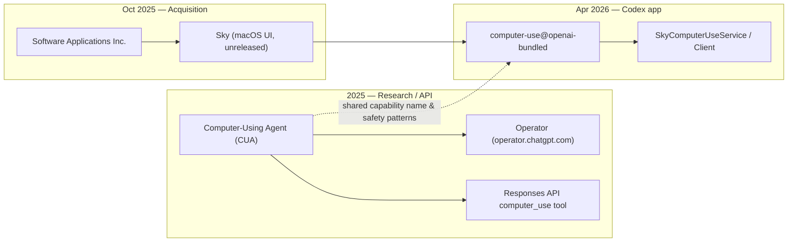

# OpenAI Codex Computer Use Plugin — Research Notes

*Compiled: May 16, 2026. Sources are public announcements, OpenAI developer docs, GitHub (`openai/codex`), and press coverage.*

## Executive summary

The **Computer Use plugin** in the Codex desktop app lets Codex see and control macOS apps (click, type, scroll) via Screen Recording and Accessibility permissions. It ships as a **bundled plugin** (`computer-use@openai-bundled`) inside the Codex app, invoked with `@Computer` or `@AppName`.

The feature is **not a standalone open-source plugin repo**. Most of the macOS integration stack traces to **Software Applications Incorporated (SAI)** and its unreleased Mac product **Sky**, which OpenAI **acquired in October 2025**. The SAI team joined OpenAI; that technology was productized into Codex’s Computer Use launch in **April 2026**.

A separate but related line of work is OpenAI’s **Computer-Using Agent (CUA)** model and **Operator** (January 2025), which power cloud/browser computer use. Codex’s plugin reuses similar ideas on the desktop, with internal binaries still branded **Sky** (`SkyComputerUseService`, `SkyComputerUseClient`).

---

## Company

| | |
|---|---|
| **Legal entity** | OpenAI, L.L.C. (and related OpenAI entities) |
| **Product surface** | [Codex](https://openai.com/codex/) desktop app (macOS); documented at [Computer Use](https://developers.openai.com/codex/app/computer-use) |
| **Acquired technology** | [Software Applications Incorporated](https://software.inc/) — maker of **Sky** ([acquisition announcement](https://openai.com/index/openai-acquires-software-applications-incorporated/), Oct 23, 2025) |
| **Deal leadership (OpenAI)** | Nick Turley (VP & Head of ChatGPT), Fidji Simo (CEO of Applications); board Transaction and Audit Committees approved |

OpenAI stated that **all SAI team members** would join OpenAI. SAI’s site described a **~10-person** team (Silicon Republic, Oct 2025); the full roster was never published on their website.

---

## What the plugin is (technical)

- **Plugin ID:** `computer-use@openai-bundled` (OpenAI bundled marketplace)
- **Install path (typical):** `Codex.app/Contents/Resources/plugins/openai-bundled/plugins/computer-use`
- **macOS helpers (from user reports / logs):** `SkyComputerUseService`, `SkyComputerUseClient`; bundle ID references such as `com.openai.sky.CUAService`
- **Permissions:** Screen Recording + Accessibility (Codex app); per-app allowlists in Codex settings
- **User entry points:** `@Computer`, `@Slack`, etc.; falls back to Computer Use when no dedicated app plugin exists
- **Availability (at launch):** macOS; **not** EEA, UK, or Switzerland initially ([changelog](https://developers.openai.com/codex/changelog), Apr 16, 2026)

Related Codex surfaces (same Apr 2026 release, different components):

- **In-app browser** — local/public web pages for dev feedback (not the same as Computer Use)
- **90+ plugins** — curated marketplace integrations (Slack, Linear, etc.)

---

## Timeline

| Date | Event |
|------|--------|
| **Jan 23, 2025** | OpenAI announces **CUA** and research preview **Operator** ([Computer-Using Agent](https://openai.com/index/computer-using-agent/)) |
| **Aug 2023** | SAI founded (ex-Apple team); building Sky for Mac |
| **Oct 23, 2025** | OpenAI acquires SAI / Sky team joins OpenAI |
| **Apr 16, 2026** | Major Codex update: “background computer use,” browser, plugins, memory preview ([Codex for (almost) everything](https://openai.com/so-DJ/index/codex-for-almost-everything/)) |
| **Apr 17, 2026** | PR [#18219](https://github.com/openai/codex/pull/18219): add `computer-use@openai-bundled` to core plugin discovery (Leo Shimonaka) |
| **Apr 23, 2026** | PR [#19071](https://github.com/openai/codex/pull/19071): `computer_use` feature requirement key |
| **Apr 23, 2026** | GPT-5.5 announced with emphasis on computer use in Codex |
| **May 2026** | Ari Weinstein + Romain Huet publish walkthrough video on Computer Use in Codex |

---

## People and roles

### Core product / engineering (Computer Use in Codex)

Public sources most strongly tie **Computer Use in Codex** to the **SAI (Sky) team** after the acquisition, with **Ari Weinstein** as the visible product lead.

| Person | Role (public) | Relevance |
|--------|----------------|-----------|
| **Ari Weinstein** | Co-founder & CEO, SAI; now OpenAI | Quoted on Sky acquisition; [stated his team developed Computer Use for Codex](https://matthewcassinelli.com/shortcuts-lead-ari-weinstein-now-at-openai-talking-computer-use-for-codex/) in May 2026 walkthrough with Romain Huet. Previously co-founded **Workflow** (sold to Apple → **Shortcuts**). |
| **Conrad Kramer** | Co-founder & CTO, SAI; now OpenAI | Co-founded Workflow with Weinstein; deep macOS/automation background ([The Verge](https://www.theverge.com/2023/11/29/23981802/software-applications-inc-workflow-shortcuts-apple-employees-startup)). |
| **Kim Beverett** | Co-founder / COO, SAI; now OpenAI | ~10 years at Apple (Safari, Messages, FaceTime, privacy, WWDC); SAI operations ([The Verge](https://www.theverge.com/2023/11/29/23981802/software-applications-inc-workflow-shortcuts-apple-employees-startup)). |
| **Leo Shimonaka** | Founding engineer, SAI ([personal site](https://leoshimo.com/)); GitHub **@leoshimo-oai** | Primary **public GitHub author** on Codex Computer Use integration (plugin discovery, feature flags, policy PRs). Personal site still references SAI/Sky; LinkedIn lists SAI through Nov 2025. |
| **Other SAI employees** | ~10 total at acquisition | Not named in OpenAI’s acquisition post; only founders widely covered in press. |

### OpenAI leadership (product org, not day-to-day implementation)

| Person | Role (public) | Relevance |
|--------|----------------|-----------|
| **Thibault Sottiaux** (“Tibo”) | Head of Codex ([Every podcast](https://every.to/podcast/how-openai-s-codex-team-uses-their-coding-agent), Feb 2026) | Owns Codex product direction; Computer Use shipped as part of broader Codex app strategy. |
| **Andrew Ambrosino** | Member of Technical Staff, Codex app | Codex app UX (GUI vs terminal, automations); same podcast. |
| **Nick Turley** | VP & Head of ChatGPT | Quoted on SAI acquisition; computer-use vision for ChatGPT on Mac. |
| **Fidji Simo** | CEO of Applications, OpenAI | Led acquisition with Turley ([TechCrunch](https://techcrunch.com/2025/10/23/openai-buys-sky-an-ai-interface-for-mac/)). |
| **Romain Huet** | Head of Developer Experience | [Demo/interview partner](https://matthewcassinelli.com/shortcuts-lead-ari-weinstein-now-at-openai-talking-computer-use-for-codex/) with Weinstein on Computer Use (May 2026); developer relations, not credited as builder. |

### CUA / Operator research (related, upstream)

The **January 2025 CUA** effort is a distinct research/product line (cloud Operator), but it shares the “computer use” capability name and safety patterns.

The [Operator System Card](https://cdn.openai.com/operator_system_card.pdf) credits many OpenAI researchers and safety staff (e.g. Alex Beutel, Eric Wallace, Shunyu Yao, Peter Welinder, and others). The main CUA blog post lists **Authors: OpenAI** without individual names.

### Visible GitHub contributors (`openai/codex`, Computer Use–related)

From merged/open PRs and reviews (Apr–May 2026):

| GitHub | Activity |
|--------|----------|
| **@leoshimo-oai** (Leo Shimonaka) | Author: [#18219](https://github.com/openai/codex/pull/18219), [#19071](https://github.com/openai/codex/pull/19071); draft [#20488](https://github.com/openai/codex/pull/20488) (allowlists / persistent approvals) |
| **@xl-openai** | Reviewer/approver on Computer Use PRs |
| **@gpeal** (Gabriel Peal) | Requested reviewer on [#18219](https://github.com/openai/codex/pull/18219); OpenAI engineer, active on Codex MCP work |
| **@dylan-hurd-oai** | Approver on [#19071](https://github.com/openai/codex/pull/19071) |
| **@sayan-oai**, **@shijie-oai** | Reviewers on [#19071](https://github.com/openai/codex/pull/19071) |

OpenAI employees use `-oai` GitHub accounts; **`-oai` handles are not always mapped to public legal names** beyond what press/LinkedIn provide.

---

## How Computer Use relates to CUA and Sky

- **Sky / SAI:** Native macOS screen understanding + actions (accessibility tree, app control). Acquired for “deep macOS integration.”
- **CUA:** General screenshot → action loop for web/OS benchmarks; powers Operator and later API [`computer_use` tool](https://developers.openai.com/api/docs/guides/tools-computer-use).
- **Codex Computer Use plugin:** Productized **local** macOS control inside Codex, bundled helpers still named **Sky**.

Press and commentators ([Engadget](https://www.engadget.com/ai/openais-latest-codex-update-builds-the-groundwork-for-its-upcoming-super-app-170000019.html), [Neowin](https://www.neowin.net/news/openai-expands-codex-beyond-coding-with-computer-use-memory-and-plugins/)) describe Computer Use as grounded in the Sky acquisition.

---

## Organizational placement (best public inference)

OpenAI does **not** publish an org chart for this plugin. Reasonable structure from sources:

1. **Applications / ChatGPT** (Fidji Simo, Nick Turley) — SAI acquisition, macOS “get things done” vision  
2. **Codex** (Thibault Sottiaux) — Desktop app, plugins, developer workflows  
3. **SAI / Sky alumni** (Weinstein, Kramer, Beverett, Shimonaka, ~6 others) — macOS computer-use implementation and product craft  
4. **Research / Applied** — CUA model, safety, Operator (overlapping capability, different deployment)

Computer Use in Codex is best understood as a **joint Applications + Codex + ex-SAI engineering** deliverable, with **Weinstein’s team** credited publicly for the Codex feature itself.

---

## Documentation and announcements

| Resource | URL |
|----------|-----|
| Computer Use (Codex app) | https://developers.openai.com/codex/app/computer-use |
| Use case guide | https://developers.openai.com/codex/use-cases/use-your-computer-with-codex |
| Apr 2026 Codex release post | https://openai.com/so-DJ/index/codex-for-almost-everything/ |
| SAI acquisition | https://openai.com/index/openai-acquires-software-applications-incorporated/ |
| CUA / Operator (Jan 2025) | https://openai.com/index/computer-using-agent/ |
| API computer use | https://developers.openai.com/api/docs/guides/tools-computer-use |
| Codex changelog | https://developers.openai.com/codex/changelog |

---

## Limits of public information

- **No complete SAI employee list** after acquisition (only founders + Shimonaka are well documented).
- **No public mapping** of every `-oai` GitHub account to full names.
- **Bundled plugin source** is not in the public `openai/codex` repo; only integration/feature-flag code appears there.
- **Internal codenames** (`Sky*`, `CUAService`, Linear tickets like `SAI-13224` on PRs) confirm lineage but not full team ownership.

---

## Sources

- OpenAI: [Acquires SAI](https://openai.com/index/openai-acquires-software-applications-incorporated/), [CUA](https://openai.com/index/computer-using-agent/), [Codex for almost everything](https://openai.com/so-DJ/index/codex-for-almost-everything/), [Computer Use docs](https://developers.openai.com/codex/app/computer-use)
- GitHub: [openai/codex PR #18219](https://github.com/openai/codex/pull/18219), [#19071](https://github.com/openai/codex/pull/19071), [#20488](https://github.com/openai/codex/pull/20488)
- Press: [TechCrunch SAI acquisition](https://techcrunch.com/2025/10/23/openai-buys-sky-an-ai-interface-for-mac/), [The Verge SAI founding](https://www.theverge.com/2023/11/29/23981802/software-applications-inc-workflow-shortcuts-apple-employees-startup), [Silicon Republic](https://www.siliconrepublic.com/business/openai-software-applications-incorporated-sky-acquisition-mac-ai)
- Commentary: [Matthew Cassinelli on Weinstein walkthrough](https://matthewcassinelli.com/shortcuts-lead-ari-weinstein-now-at-openai-talking-computer-use-for-codex/), [Every — Codex team podcast](https://every.to/podcast/how-openai-s-codex-team-uses-their-coding-agent)
- People: [leoshimo.com](https://leoshimo.com/), [Operator System Card PDF](https://cdn.openai.com/operator_system_card.pdf)
